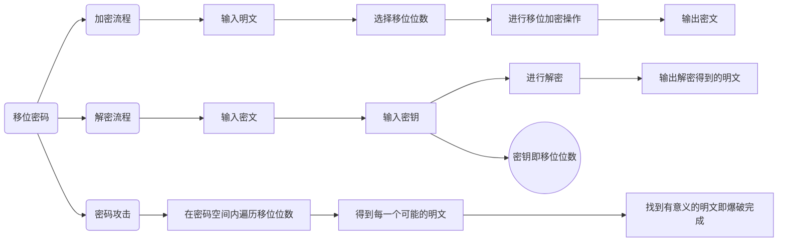
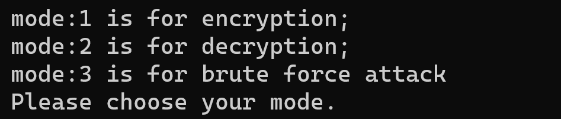
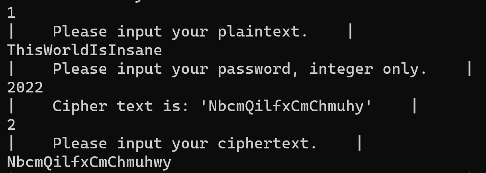
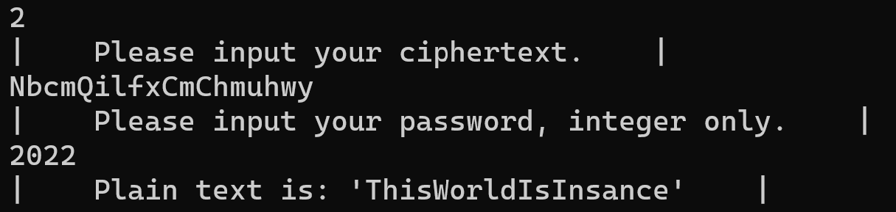
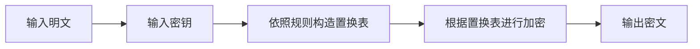

<h1><center>密码学实验报告</center></h1>

<h3><center>Lab1 古典密码算法及攻击方法</center></h3>

<center>学号： 2011839 &emsp; 姓名：刘扬&emsp; 专业：信安法</center>

## 实验概述

### 一、实验目的

  通过C＋＋编程实现移位密码和单表置换密码算法，加深对经典密码体制的了解。并通过对这两种密码实施攻击，了解对古典密码体制的攻击方法。

### 二、   实验原理

#### 1. 移位密码

将英文字母**向前或向后移动一个固定位置**。例如向后移动3个位置，即对字母表作置换（不分大小写）。

$$
A  B  C  D  E  F  G  H  I  J  K  L  M  N  O  P  Q  R  S  T  U  V  W  X  Y  Z \\

D E  F  G  H  I  J  K  L  M  N  O  P  Q  R  S  T  U  V  W  X  Y  Z  A  B  C
$$
*设明文为：public keys,则经过以上置换就变成了：sxeolf nhbv。*

 如果将26个英文字母进行编码：A→0，B→1，…，Z→25，则以上加密过程可简单地写成：

$$
\begin{array}{l}
明文：m＝m_1m_2\dots m_i\dots , &则有\\
密文：c=c_1c_2\dots c_i\dots, &其中 c_i=(m_i+key \mod26)，i＝1，2，…。
\end{array}
$$
#### 2. 对移位密码的攻击

移位密码是一种最简单的密码，其**有效密钥空间大小为25**。因此，很容易用**穷举**的方法攻破。穷举密钥攻击是指攻击者对可能的密钥的穷举，也就是<u>用所有可能的密钥解密密文，直到得到有意义的明文，由此确定出正确的密钥和明文</u>的攻击方法。对移位密码进行穷举密钥攻击，**最多只要试译25次**就可以得到正确的密钥和明文。

#### 3. 单表置换密码

单表置换密码就是根据字母表的置换对明文进行变换的方法，例如，给定置换

$$
A B  C  D  E  F  G  H  I  J  K  L  M  N  O  P  Q  R  S  T  U  V  W  X  Y  Z\\

H K  W  T  X  Y  S  G  B  P  Q  E  J  A  Z  M  L  N  O  F  C  I  D  V  U  R
$$

*设明文：public keys, 则有密文：mckebw qxuo。*

单表置换实现的一个关键问题是关于**置换表的构造**。置换表的构造可以有各种不同的途径，主要考虑的是记忆的方便。如使用一个短语或句子，删去其中的重复部分，作为置换表的前面的部分，然后把没有用到的字母按字母表的顺序依次放入置换表中。

#### 4. 对单表置换密码的攻击方法

在单表置换密码中，由于置换表字母组合方式有26！种，约为$4.03\times1026$。

所以采用穷举密钥的方法不是一种最有效的方法。对单表置换密码最有效的攻击方法是利用自然语言的使用频率：单字母、双字母组/三字母组、短语、词头/词尾等，这里仅考虑英文的情况。英文的一些显著特征如下:

  短单词(small words)：在英文中只有很少几个非常短的单词。因此，如果在一个加密的文本中可以确定单词的范围，那么就能得出明显的结果。一个字母的单词只有a和I。如果不计单词的缩写，在从电子邮件中选取500k字节的样本中，只有两个字母的单词仅出现35次，而两个字母的所有组合为26×26＝676种。而且，还是在那个样本中，只有三个字母的单词出现196次，而三个字母的所有组合为26×26×26＝17576种。

常用单词(common words):再次分析500k字节的样本，总共有5000多个不同的单词出现。在这里，9个最常用的单词出现的总次数占总单词数的21％，20个最常用的单词出现的总次数占总单词数的30％，104个最常用的单词占50％，247个最常用的单词占60％。样本中最常用的9个单词占总词数的百分比为：

   the 4.65   to  3.02  of  2.61  I  2.2  a  1.95

   and 1.82   is  1.68  that 1.62  in  1.57

字母频率(character frequency):在1M字节旧的电子文本中，对字母”A”到“Z”（忽略大小写）分别进行统计。发现近似频率（以百分比表示）：

  e 11.67  t 9.53  o 8.22  i 7.81  a 7.73  n 6.71 s 6.55

  r 5.97  h 4.52  l 4.3  d 3.24  u 3.21  c 3.06 m 2.8

  p 2.34  y 2.22  f 2.14  g 2.00  w 1.69  b 1.58 v 1.03

  k 0.79  x 0.30  j 0.23  q 0.12  z 0.09

从该表中可以看出，最常用的单字母英文是e和t，其他字母使用频率相对来说就小得多。这样，攻击一个单表置换密码，首先统计密文中最常出现的字母，并据此猜出两个最常用的字母，并根据英文统计的其他特征（如字母组合等）进行试译。

### 三、    实验环境

运行Windows操作系统的PC机，具有VC等语言编译环境

### 四、    实验内容和步骤

1. 根据实验原理部分对移位密码算法的介绍，自己创建明文信息，并选择一个密钥，编写移位密码算法实现程序，实现加密和解密操作。
2. 两个同学为一组，互相攻击对方用移位密码加密获得的密文，恢复出其明文和密钥。
3. 自己创建明文信息，并选择一个密钥，构建置换表。编写置换密码的加解密实现程序，实现加密和解密操作。
4. 用频率统计方法，试译下面用单表置换加密的一段密文：

SIC GCBSPNA XPMHACQ JB GPYXSMEPNXIY JR SINS MF SPNBRQJSSJBE JBFMPQNSJMB FPMQ N XMJBS N SM N XMJBS H HY QCNBR MF N XMRRJHAY JBRCGZPC GINBBCA JB RZGI N VNY SINS SIC MPJEJBNA QCRRNEC GNB MBAY HC PCGMTCPCD HY SIC PJEISFZA PCGJXJCBSR SIC XNPSJGJXNBSR JB SIC SPNBRNGSJMB NPC NAJGC SIC MPJEJBNSMP MF SIC QCRRNEC HMH SIC PCGCJTCP NBD MRGNP N XMRRJHAC MXXMBCBS VIM VJRICR SM ENJB ZBNZSIMPJOCD GMBSPMA MF SIC QCRRNEC

写出获得的明文消息和置换表。

### 五、    实验报告和要求

要求上述密码算法提供最后的算法流程图，并写出明文、加解密的结果。

字母频率统计攻击方法要求写明置换表中确定每个字母的原因和攻击的步骤。

## 实验流程

### 移位密码


#### 定义shift_cipher移位密码类

``` cpp
class shift_cipher {
private:
	int offset; // integer for shift offset in the shift cipher algorithm
				// this can >0, means shift backwards; if <0, means shift forwards.
				// offset would mod 26 later, so it's not neccessary to consider that
public:
	shift_cipher() { offset = 0; }
	shift_cipher(int offset) { this->offset = offset; }
	char* shift_encrypt(char* plain_txt, int offset);	// funciton of encryption
	char* shift_decrypt(char* cipher_txt, int offset); // function fo decryption
	void brute_force(char* cipher_txt);				// brute force attack simulate
};
```

1. 选择加密、解密或暴破攻击

   

2. 加密模式：

``` cpp
char* shift_cipher::shift_encrypt(char* plain_txt, int offset){
	int shft = offset % 26; // because offset might be very large, but the space
								// of shift cipher is only 26 (the length of alphabet) 
								// in this case. (english ver.)
	string plain_str = plain_txt; // convert char* into string in order to get len
	int plain_len = plain_str.length(); //get the length of plain text
	char* cipher_txt = new char[plain_len];
	for (int i = 0; i < plain_len; i++)
	{ // we would use ascii code to represent a-zA-Z in this case
		if (plain_txt[i] >= 65 && plain_txt[i] <= 90) {		// ascii code A-Z
			int now_pos = (plain_txt[i] - 65 + shft) % 26 + 65;	// get the right ascii
			cipher_txt[i] = (char)now_pos;					// ascii to char
			continue;
		}
		if (plain_txt[i] >= 97 && plain_txt[i] <= 122) {	// ascii code a-z
			int now_pos = (plain_txt[i] - 97 + shft) % 26 + 97; // get the right ascii
			cipher_txt[i] = (char)now_pos;					// ascii to char
			continue;
		}
		cipher_txt[i] = plain_txt[i];						// not in the alphabet
	}
	cipher_txt[plain_len] = '\0';							// the end of chars
	return cipher_txt;
}
```

   

3. 解密模式

``` cpp
char* shift_cipher::shift_decrypt(char* cipher_txt, int offset) {
	int shft = offset % 26; // because offset might be very large, but the space
								// of shift cipher is only 26 (the length of alphabet) 
								// in this case. (english ver.)
	string cipher_str = cipher_txt; // convert char* into string in order to get len
	int cipher_len = cipher_str.length(); //get the length of plain text
	char* plain_txt = new char[cipher_len];
	for (int i = 0; i < cipher_len; i++)
	{ // we would use ascii code to represent a-zA-Z in this case
		if (cipher_txt[i] >= 65 && cipher_txt[i] <= 90) {		// ascii code A-Z
			int now_pos = (cipher_txt[i] - 65 + (26 - shft)) % 26 + 65;	// get the right ascii
			plain_txt[i] = (char)now_pos;						// ascii to char
			continue;
		}
		if (cipher_txt[i] >= 97 && cipher_txt[i] <= 122) {		// ascii code a-z
			int now_pos = (cipher_txt[i] - 97 + (26 - shft)) % 26 + 97;	// get the right ascii
			plain_txt[i] = (char)now_pos;						// ascii to char
			continue;
		}
		plain_txt[i] = cipher_txt[i];							// not in the alphabet
	}
	plain_txt[cipher_len] = '\0';								// the end of chars
	return plain_txt;											// decyption fiished
}

```

   

4. 暴破攻击

``` cpp
void shift_cipher::brute_force(char* cipher_txt) {
	cout << "|    Cipher text is: \'" << cipher_txt << "\'    |" << endl;
	for (int i = 0; i < 26; i++) {								// space size for alphabet: 26	
		cout << "|    Offset is set to " << i << "; then the plain text is: \' "
			<< shift_decrypt(cipher_txt, i) << "\'    |" << endl;
	}
	cout << "|    Brute force decryption finished.    |" << endl;
}
```

   

### 构建单表置换密码的置换表




``` cpp
#include<iostream>
#include<map>
#include<string>
#include<stdio.h>
using namespace std;
int get_length(char* text) {
	int i = 0;
	while (text[i] != '\0') {
		i++;
	}
	return i;
}
map<char, char> list;
int* a = new int[26];
int main() {
	char* text = new char[1000];
	for (int i = 0; i < 26; i++) {
		a[i] = 0;
	}
	cout << "输入密钥，如果密钥长度大于26位，则只取前26位" << endl;
	cin >> text;
	if (get_length(text) > 26) {
		text[26] = '\0';
	}
	//全部改为小写 去重
	int t = 0;
	for (int i = 0; i < get_length(text); i++) {
		text[i] = tolower(text[i]);
		if (text[i] < 97 || text[i] > 122) {
			continue;
		}
		if (a[(int)(text[i] - 'a')]) {
			continue;
		}
		else {
			a[(int)(text[i] - 'a')] = 1;
			list[(char)('a' + t)] = text[i];
			t++;
		}
	}
	for (int j = t; j < 26; j++) {
		char temp = '\0';
		for (int k = 0; k < 26; k++) {
			if (a[k] == 0) {
				a[k] = 1;
				temp = (char)('a' + k);
				break;
			}
		}
		list[(char)('a' + j)] = temp;
	}
	cout << endl << "替换表为：  " << endl;
	for (int j = 0; j < 26; j++) {
		cout << (char)('a' + j) << " ";
	}
	cout << endl;
	for (int j = 0; j < 26; j++) {
		cout << list[(char)('a' + j)] << " ";
	}
	cout << endl;
	char* plaintext = new char[1000];
	char* ciphertext = new char[1000];
	cout << "您的密文为：  " << endl;
	cin.get();
	cin.getline(ciphertext, 1000);
	int len = get_length(ciphertext);
	for (int j = 0; j < len; j++) {
		ciphertext[j] = tolower(ciphertext[j]);
		if (ciphertext[j] < 97 || ciphertext[j] > 122) {
			plaintext[j] = ciphertext[j];
		}
		else {
			for (std::map<char, char>::iterator it = list.begin(); it != list.end(); it++) {
				if (it->second == ciphertext[j]) {
					plaintext[j] = it->first;
				}
			}
		}
	}
	plaintext[len] = '\0';
	cout << "您的明文为：  " << plaintext << endl;
	return 0;
}
```

### 单表置换频率统计

``` cpp
#include<iostream>
#include<string>
using namespace std;
int get_length(char* text) {
	int i = 0;
	while (text[i] != '\0') {
		i++;
	}
	return i;
}
class letter {
private:
	int num;
	char letter_old;
	char letter_new;
public:
	letter() {
		num = 0;
		letter_old = '\0';
		letter_new = '\0';
	}
	letter(char a) {
		num = 0;
		letter_old = a;
		letter_new = '\0';
	}
	void set_old(char a) {
		letter_old = a;
	}
	void set_num(int a) {
		num = a;
	}
	void num_plus() {
		num++;
	}
	void set_new(char a) {
		letter_new = a;
	}
	char get_old() {
		return letter_old;
	}
	char get_new() {
		return letter_new;
	}
	int get_num() {
		return num;
	}
};
void letter_sort(letter a[]) {
	for (int i = 1; i < 26; i++) {
		for (int j = 0; j < 26 - i; j++) {
			if (a[j].get_num() < a[j + 1].get_num()) {
				char t1 = a[j].get_old();
				a[j].set_old(a[j + 1].get_old());
				a[j + 1].set_old(t1);
				int t2 = a[j].get_num();
				a[j].set_num(a[j + 1].get_num());
				a[j + 1].set_num(t2);
			}
		}
	}
}
int main() {
	char re[27];
	memset(re, '\0', 27);
	letter text_letter[26];
	for (int i = 0; i < 26; i++) {
		text_letter[i].set_old('a' + i);
	}
	cout << "请输入您的文本段:" << endl;
	char* text = new char[1000];
	cin.getline(text, 1000);
	int len = get_length(text);
	double num = 0;
	for (int i = 0; i < len; i++) {
		if (text[i] >= 65 && text[i] <= 90) {
			text_letter[(int)(text[i] - 'A')].num_plus();
			num++;
		}
		if (text[i] >= 97 && text[i] <= 122) {
			text_letter[(int)(text[i] - 'a')].num_plus();
			num++;
		}
	}
	cout << "您的文本中出现的字母频率为：" << endl;
	for (int i = 0; i < 26; i++) {
		text_letter[i].set_old('a' + i);
		cout << (char)('a' + i) << "     " << (double)(text_letter[i].get_num() / num) << endl;
	}

	char real_freq[26] = { 'e','t','o','i','a','n','s','r','h','l','d','u','c','m','p','y','f','g','w','b','v','k','x','j','q','z' };
	letter_sort(text_letter);
	for (int i = 0; i < 26; i++) {
		text_letter[i].set_new(real_freq[i]);
	}
	for (int i = 0; i < 26; i++) {
		re[text_letter[i].get_new() - 'a'] = text_letter[i].get_old();
	}
	re[26] = '\0';
	cout << "置换序列: " << re;
	cout << endl;
	return 0;
}
```

