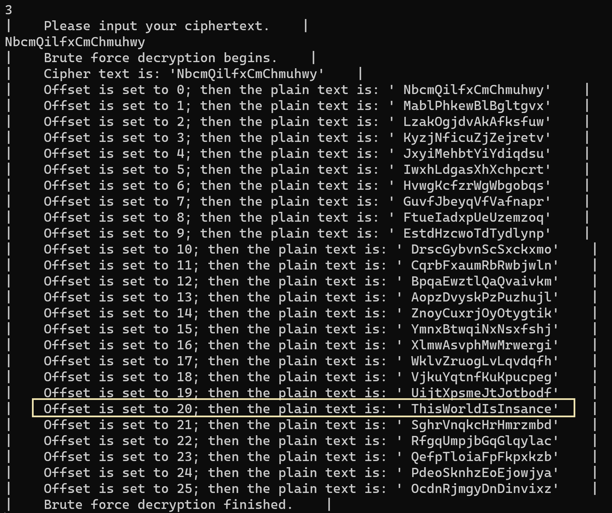

<h1><center>密码学实验报告</center></h1>

<h3><center>Lab1 古典密码算法及攻击方法</center></h3>

## 实验概述

### 一、实验目的

  通过C＋＋编程实现移位密码和单表置换密码算法，加深对经典密码体制的了解。并通过对这两种密码实施攻击，了解对古典密码体制的攻击方法。

### 二、   实验原理

#### 1. 移位密码

将英文字母**向前或向后移动一个固定位置**。例如向后移动3个位置，即对字母表作置换（不分大小写）。

$$
A  B  C  D  E  F  G  H  I  J  K  L  M  N  O  P  Q  R  S  T  U  V  W  X  Y  Z \\

D E  F  G  H  I  J  K  L  M  N  O  P  Q  R  S  T  U  V  W  X  Y  Z  A  B  C
$$
*设明文为：public keys,则经过以上置换就变成了：sxeolf nhbv。*

 如果将26个英文字母进行编码：A→0，B→1，…，Z→25，则以上加密过程可简单地写成：

$$
\begin{array}{l}
明文：m＝m_1m_2\dots m_i\dots , &则有\\
密文：c=c_1c_2\dots c_i\dots, &其中 c_i=(m_i+key \mod26)，i＝1，2，…。
\end{array}
$$
#### 2. 对移位密码的攻击

移位密码是一种最简单的密码，其**有效密钥空间大小为25**。因此，很容易用**穷举**的方法攻破。穷举密钥攻击是指攻击者对可能的密钥的穷举，也就是<u>用所有可能的密钥解密密文，直到得到有意义的明文，由此确定出正确的密钥和明文</u>的攻击方法。对移位密码进行穷举密钥攻击，**最多只要试译25次**就可以得到正确的密钥和明文。

#### 3. 单表置换密码

单表置换密码就是根据字母表的置换对明文进行变换的方法，例如，给定置换

$$
A B  C  D  E  F  G  H  I  J  K  L  M  N  O  P  Q  R  S  T  U  V  W  X  Y  Z\\

H K  W  T  X  Y  S  G  B  P  Q  E  J  A  Z  M  L  N  O  F  C  I  D  V  U  R
$$

*设明文：public keys, 则有密文：mckebw qxuo。*

单表置换实现的一个关键问题是关于**置换表的构造**。置换表的构造可以有各种不同的途径，主要考虑的是记忆的方便。如使用一个短语或句子，删去其中的重复部分，作为置换表的前面的部分，然后把没有用到的字母按字母表的顺序依次放入置换表中。

#### 4. 对单表置换密码的攻击方法

在单表置换密码中，由于置换表字母组合方式有26！种，约为$4.03\times1026$。

所以采用穷举密钥的方法不是一种最有效的方法。对单表置换密码最有效的攻击方法是利用自然语言的使用频率：单字母、双字母组/三字母组、短语、词头/词尾等，这里仅考虑英文的情况。英文的一些显著特征如下:

  短单词(small words)：在英文中只有很少几个非常短的单词。因此，如果在一个加密的文本中可以确定单词的范围，那么就能得出明显的结果。一个字母的单词只有a和I。如果不计单词的缩写，在从电子邮件中选取500k字节的样本中，只有两个字母的单词仅出现35次，而两个字母的所有组合为26×26＝676种。而且，还是在那个样本中，只有三个字母的单词出现196次，而三个字母的所有组合为26×26×26＝17576种。

### 三、    实验环境

运行Windows操作系统的PC机，具有VC等语言编译环境

### 四、    实验内容和步骤

1. 根据实验原理部分对移位密码算法的介绍，自己创建明文信息，并选择一个密钥，编写移位密码算法实现程序，实现加密和解密操作。

2. 两个同学为一组，互相攻击对方用移位密码加密获得的密文，恢复出其明文和密钥。

3. 自己创建明文信息，并选择一个密钥，构建置换表。编写置换密码的加解密实现程序，实现加密和解密操作。

4. 用频率统计方法，试译下面用单表置换加密的一段密文：

   ```
   SIC GCBSPNA XPMHACQ JB GPYXSMEPNXIY JR SINS MF SPNBRQJSSJBE JBFMPQNSJMB FPMQ N XMJBS N SM N XMJBS H HY QCNBR MF N XMRRJHAY JBRCGZPC GINBBCA JB RZGI N VNY SINS SIC MPJEJBNA QCRRNEC GNB MBAY HC PCGMTCPCD HY SIC PJEISFZA PCGJXJCBSR SIC XNPSJGJXNBSR JB SIC SPNBRNGSJMB NPC NAJGC SIC MPJEJBNSMP MF SIC QCRRNEC HMH SIC PCGCJTCP NBD MRGNP N XMRRJHAC MXXMBCBS VIM VJRICR SM ENJB ZBNZSIMPJOCD GMBSPMA MF SIC QCRRNEC
   ```

写出获得的明文消息和置换表。

### 五、    实验报告和要求

要求上述密码算法提供最后的算法流程图，并写出明文、加解密的结果。

字母频率统计攻击方法要求写明置换表中确定每个字母的原因和攻击的步骤。

## 实验流程

### 一、移位密码


#### 定义shift_cipher移位密码类

``` cpp
class shift_cipher {
private:
	int offset; // integer for shift offset in the shift cipher algorithm
				// this can >0, means shift backwards; if <0, means shift forwards.
				// offset would mod 26 later, so it's not neccessary to consider that
public:
	shift_cipher() { offset = 0; }
	shift_cipher(int offset) { this->offset = offset; }
	char* shift_encrypt(char* plain_txt, int offset);	// funciton of encryption
	char* shift_decrypt(char* cipher_txt, int offset); // function fo decryption
	void brute_force(char* cipher_txt);				// brute force attack simulate
};
```

1. 选择加密、解密或暴破攻击

   

2. 加密模式：

``` cpp
char* shift_cipher::shift_encrypt(char* plain_txt, int offset){
	int shft = offset % 26; // because offset might be very large, but the space
								// of shift cipher is only 26 (the length of alphabet) 
								// in this case. (english ver.)
	string plain_str = plain_txt; // convert char* into string in order to get len
	int plain_len = plain_str.length(); //get the length of plain text
	char* cipher_txt = new char[plain_len];
	for (int i = 0; i < plain_len; i++)
	{ // we would use ascii code to represent a-zA-Z in this case
		if (plain_txt[i] >= 65 && plain_txt[i] <= 90) {		// ascii code A-Z
			int now_pos = (plain_txt[i] - 65 + shft) % 26 + 65;	// get the right ascii
			cipher_txt[i] = (char)now_pos;					// ascii to char
			continue;
		}
		if (plain_txt[i] >= 97 && plain_txt[i] <= 122) {	// ascii code a-z
			int now_pos = (plain_txt[i] - 97 + shft) % 26 + 97; // get the right ascii
			cipher_txt[i] = (char)now_pos;					// ascii to char
			continue;
		}
		cipher_txt[i] = plain_txt[i];						// not in the alphabet
	}
	cipher_txt[plain_len] = '\0';							// the end of chars
	return cipher_txt;
}
```

   

3. 解密模式

``` cpp
char* shift_cipher::shift_decrypt(char* cipher_txt, int offset) {
	int shft = offset % 26; // because offset might be very large, but the space
								// of shift cipher is only 26 (the length of alphabet) 
								// in this case. (english ver.)
	string cipher_str = cipher_txt; // convert char* into string in order to get len
	int cipher_len = cipher_str.length(); //get the length of plain text
	char* plain_txt = new char[cipher_len];
	for (int i = 0; i < cipher_len; i++)
	{ // we would use ascii code to represent a-zA-Z in this case
		if (cipher_txt[i] >= 65 && cipher_txt[i] <= 90) {		// ascii code A-Z
			int now_pos = (cipher_txt[i] - 65 + (26 - shft)) % 26 + 65;	// get the right ascii
			plain_txt[i] = (char)now_pos;						// ascii to char
			continue;
		}
		if (cipher_txt[i] >= 97 && cipher_txt[i] <= 122) {		// ascii code a-z
			int now_pos = (cipher_txt[i] - 97 + (26 - shft)) % 26 + 97;	// get the right ascii
			plain_txt[i] = (char)now_pos;						// ascii to char
			continue;
		}
		plain_txt[i] = cipher_txt[i];							// not in the alphabet
	}
	plain_txt[cipher_len] = '\0';								// the end of chars
	return plain_txt;											// decyption fiished
}

```

   

4. 暴破攻击

``` cpp
void shift_cipher::brute_force(char* cipher_txt) {
	cout << "|    Cipher text is: \'" << cipher_txt << "\'    |" << endl;
	for (int i = 0; i < 26; i++) {								// space size for alphabet: 26	
		cout << "|    Offset is set to " << i << "; then the plain text is: \' "
			<< shift_decrypt(cipher_txt, i) << "\'    |" << endl;
	}
	cout << "|    Brute force decryption finished.    |" << endl;
}
```

   

### 二、构建单表置换密码的置换表

#### 1. 单表置换流程图


#### 2. 构造置换表

单表置换的算法主要是通过对输入的`password`短语进行去重（在本实验中先采用了全部转小写，方便后续的密码构造），然后按照映射关系构造新的字母表，与26字母表的长度相同且存在映射关系，需要具有**双向查表**的功能，方便加密/解密两个逆向的过程。

基于这些要求，我们选择使用`map`结构，构造两组`char`的映射关系。

``` cpp
map<char, char> sub_list;
```

因为在构造替换表的过程中，我们需要知道哪些字母已经用过，哪些字母没有用过，以便将替换表补全。所以我们还需要一个数组结构来记录字母的使用情况，长度为26，使用过将对应位置为1，没有使用过将对应位置为0。

```cpp
// 在构造函数中进行数组alphabet的初始化，即所有字母都没有使用过，置为0
substitute_cipher() { 
	for (int i = 0; i < ALPHABET_LEN; i++) 
	alphabet[i] = 0; 
};
// 在构造置换表的时候，循环内
if (alphabet[(int)(g[i] - 'a')])// 已被替换，继续循环
	continue;
else {
	alphabet[(int)(g[i] - 'a')] = 1;// 设置该字母已被使用
	sub_list[(char)('a' + pos)] = g[i];// 将该字母g[i]放入替换列表当中
	pos++;// int pos是对sub_list的位置指针，用来记录已经完成了多少个字母的替换
}
// 把剩余的sub_list用未使用过的字母填满
for (int j = pos; j < ALPHABET_LEN; j++) {// 从现在的位置指针处开始补全替换表
	char first_unused = '\0';
	for (int k = 0; k < ALPHABET_LEN; k++) {
		if (alphabet[k] == 0) {
			alphabet[k] = 1;
			first_unused = (char)('a' + k);// 按字母表顺序找到第一个未被使用过的字母
			break;
		}
	}
	sub_list[(char)('a' + j)] = first_unused;// 把找到的字母按顺序放入替换列表中
}
```

构造完毕以后可以再写一个`print_subtable`的方法把替换表打印出来。


#### 3. 加密与解密过程

因为我们在前面使用了`map<char,char>`的结构来建立替换表，所以在加密、解密过程中我们直接利用`map`来进行映射就可以完成加密和解密。

``` cpp
for (int i = 0; i < plain_len; i++) {// 使用双层循环完成加密
	p[i] = tolower(p[i]);
	if (p[i] < 97 || p[i]>122) {
		cipher_txt[i] = p[i];
	}
	else {
		for (map<char, char>::iterator it = sub_list.begin(); it != sub_list.end(); it++) { // 从替换表的头部开始寻找
			if (it->first == p[i])// map的first是明文字母表
				cipher_txt[i] = it->second;// 找到对应的密文字母表，替换
		}
	}
}
cipher_txt[plain_len] = '\0'; //记得加上终止符，否则会出现cout越界错误
```

解密同理，除了将密文和明文字母表的位置对换没有其他区别。

``` cpp
// 解密过程，通过密文找明文；与加密逻辑相同
for (map<char, char>::iterator it = sub_list.begin(); it != sub_list.end(); it++) {
	if (it->second == c[i])
		plain_txt[i] = it->first;
```

以下为加密解密的过程，本程序只实现一次，也可以用`while(true)`实现多次加密解密，也可以和移位密码一样设置多个mode进行切换。


本程序同移位密码的程序一样，将置换密码写作了一个大的类，具体的类定义如下：

``` cpp
class substitute_cipher {
private:
	map<char, char> sub_list;
	int* alphabet = new int[26];
public:
	substitute_cipher() { 
		for (int i = 0; i < ALPHABET_LEN; i++) 
		alphabet[i] = 0; 
	};
	int len(char* text);// function of getting length
	void substitute_table(char* generate);// funciton of generating table
	void print_subtable();// function of printing the sub table
	char* substitute_encrypt(char* plain_txt);// function of encryption
	char* substitute_decrypt(char* cipher_txt);// function of decryption
};
```

### 三、单表置换频率统计

由于需要统计每个字母对应的频率，可以将字母和出现频率组合为一个类。私有属性有出现次数`frequence`，替换之前的字母`letter_old`以及替换之后的字母`letter_new`。

``` cpp
class letter { // 将每一个字母看作一个类
private:
	int frequnce;	// 出现的次数
	char letter_old;
	char letter_new;
public:
	letter() {frequnce = 0;letter_old = '\0';letter_new = '\0';} // 构造，初始化，空的
	letter(char a) {frequnce = 0;letter_old = a;letter_new = '\0';} 
	void set_new(char a) {letter_new = a; }
	void set_old(char a) {letter_old = a;}	//之前的字母
	void set_frequnce(int no) {frequnce = no;}// 手动设置字母的出现的次数
	void frequnce_plus() {frequnce++;}// 出现次数+1
	char get_old() {return letter_old;}
	char get_new() {return letter_new;}
	int get_frequnce() {return frequnce;}
};
```

统计每个字母出现频率的方式：以每个字母出现的次数/总字母数量，得到`letter_ratio`。

``` cpp
letter* letter_ratio (char* text) {
	int length = len(text);
	letter* text_alphabet=new letter[ALPHABET_LEN];
	for (int i = 0; i < 26; i++) {
		text_alphabet[i].set_old('a' + i); // 先初始化为顺序字母表
	}
	double sum = 0;	// 总的字母个数
	for (int i = 0; i < length; i++) { // 只记入大小写字母
		if (text[i] >= 65 && text[i] <= 90) {
			text_alphabet[(int)(text[i] - 'A')].frequnce_plus();// 主要完成对每个字母类frequence的初始化
			sum++;
		}
		if (text[i] >= 97 && text[i] <= 122) {
			text_alphabet[(int)(text[i] - 'a')].frequnce_plus();// 主要完成对每个字母类frequence的初始化
			sum++;
		}
	}
	cout << "[The occurence ratios of each letter are: ]" << endl;
	for (int i = 0; i < ALPHABET_LEN; i++) {
		text_alphabet[i].set_old('a' + i);
		cout << (char)('a' + i) << "     " << (double)(text_alphabet[i].get_frequnce() / sum) << endl;
	}
	return text_alphabet;
}
```

从字母统计中可以得到每个字母按出现概率大小先后排序的结果：

> 常用单词(common words):再次分析500k字节的样本，总共有5000多个不同的单词出现。在这里，9个最常用的单词出现的总次数占总单词数的21％，20个最常用的单词出现的总次数占总单词数的30％，104个最常用的单词占50％，247个最常用的单词占60％。样本中最常用的9个单词占总词数的百分比为：
>
>    the 4.65   to  3.02  of  2.61  I  2.2  a  1.95
>
>    and 1.82   is  1.68  that 1.62  in  1.57
>
> 字母频率(character frequency):在1M字节旧的电子文本中，对字母”A”到“Z”（忽略大小写）分别进行统计。发现近似频率（以百分比表示）：
>
>   e 11.67  t 9.53  o 8.22  i 7.81  a 7.73  n 6.71 s 6.55
>
>   r 5.97  h 4.52  l 4.3  d 3.24  u 3.21  c 3.06 m 2.8
>
>   p 2.34  y 2.22  f 2.14  g 2.00  w 1.69  b 1.58 v 1.03
>
>   k 0.79  x 0.30  j 0.23  q 0.12  z 0.09
>
> 从该表中可以看出，最常用的单字母英文是e和t，其他字母使用频率相对来说就小得多。这样，攻击一个单表置换密码，首先统计密文中最常出现的字母，并据此猜出两个最常用的字母，并根据英文统计的其他特征（如字母组合等）进行试译。

于是把这些字母按顺序放入一个与26字母表等长的char数组当中：

``` cpp
char real_freq[ALPHABET_LEN] = { 'e','t','o','i','a','n','s','r','h','l','d','u','c','m','p','y','f','g','w','b','v','k','x','j','q','z' };
```

最后可以得到结果以及替换表。


可以得到替换表的密钥部分为：

```
0：bvexcyzimloghjnqurpsatdkfw
```

因为提供的密文太短，可能从概率统计上并不符合每个字母应当的分布，所以我们需要通过每次得到的结果进行手动调整。


可以看到本来应该是a的地方变成了o，那么我们接下来把n换到第一排a对应处，进行对换。

```
1：nvexcyzimloghjbqurpsatdkfw
```

得到的明文变成了：


可以把y和f对换，密码变为：

```
2:nvexcfzimloghjbqurpsatdkyw
```

发现ti应该是to，把b和m对换

```
3:nvexcfzibloghjmqurpsatdkyw
```

发现`nr that of `应该是句子`is that of`，则将j和b对换，r和p对换

```
4:nvexcfzijloghbmquprsatdkyw
```


发现`inforpation`应当为`information`，把h和q对换

```
5:nvexcfzijlogqbmhuprsatdkyw
```


`messace`应为`message`，把e和z对换

```
6:nvzxcfeijlogqbmhuprsatdkyw
```


`doint`应该为`point`,`anw`应该为`and`，则把x和h对调，d和h对调

```
7:nvzdcfeijlogqbmxuprsathkyw
```


wy应该为by，possiwuy应该为possibly，onuy应该为only，originau应该为original；则应该把v和h对换，g和a对换

```
8:nhzdcfeijloaqbmxuprsgtvkyw
```


总上图所述，u和c应该错位了，所以把z和g对调；unauthoriked应该为unauthorized，所以把w和o对换

```
9:nhgdcfeijlwaqbmxuprsztvkyo
```

最终得到的明文结果是：

```
the central problem in cryptography is that of transmitting information from a point a to a point b by means of a possibly insecure channel in such a way that the original message can only be recovered by the rightful recipients the participants in the transaction are alice the originator of the message bob the receiver and oscar a possible opponent who wishes to gain unauthorized control of the message
```

最终的置换表为：


所有实验完整的代码可以查看[github链接](https://github.com/runxii/crypto-labs)。
